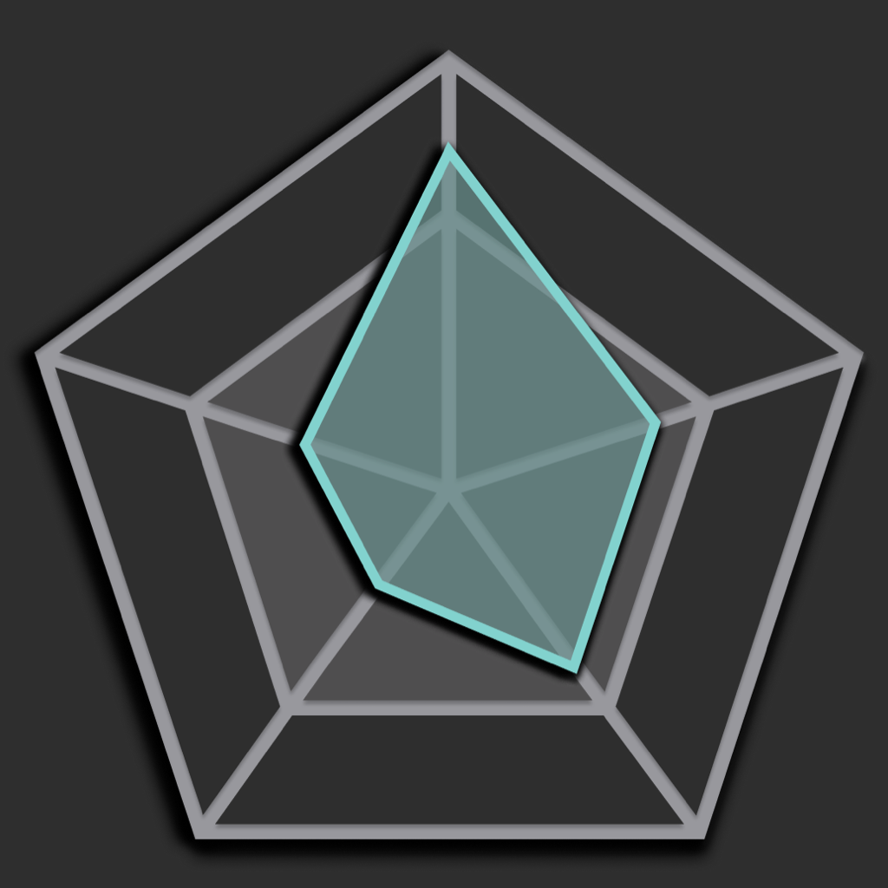

# markProject
A macOS app SwiftUI macOS tool created around Challenge Based Learning for the Apple Developer Academy.
* Swift, SwiftUI, AppKit, Networking, Airtable APIs, Python, Pandas, JSON

 
 
 

 
 

## Gallery

